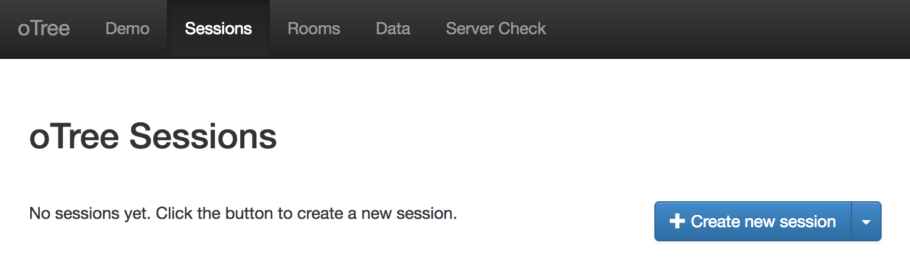
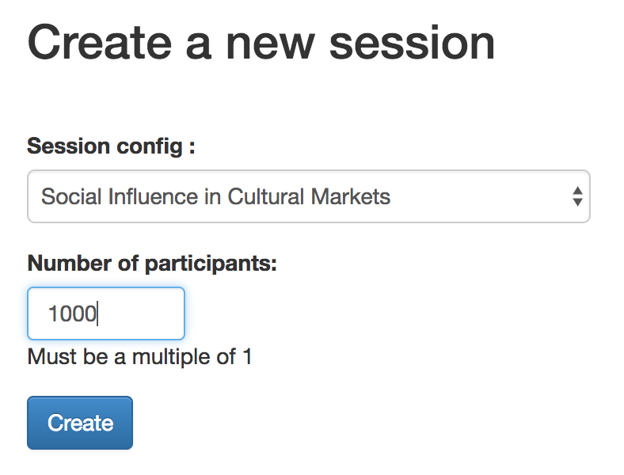
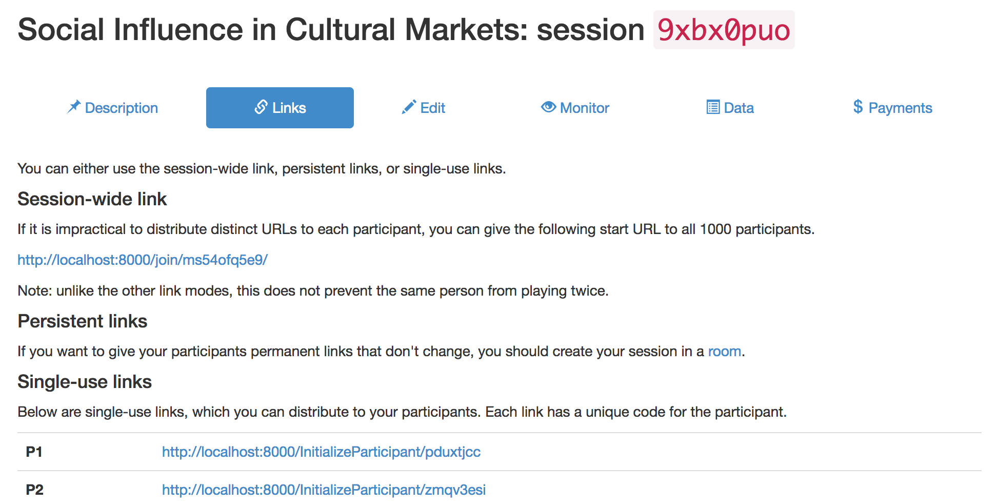
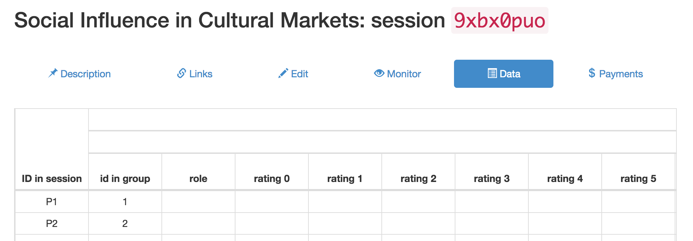
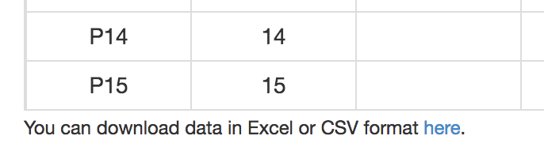

# CSS Lab: Social Influence in a Cultural Market

This lab allows you to conduct an online experiment to study social influence,
based on [SDW2006,SW2008].
The experiment uses the oTree [CSW2016] online experimentation software,
and the analysis uses python in a jupyter notebook.
You can also use this lab to re-analyze the data from the original study [SDW2006].

## Contents
1. [Analysis](#analysis)
    1. [Setup](#setup)
    1. [Requirements](#requirements)
    1. [Descriptive statistics](#descriptive-statistics)
    1. [Gini coefficient](#gini-coefficient)
    1. [Market share](#market-share)
    1. [Unpredictability](#unpredictability)
1. [Experiment](#experiment)
    1. [Installing oTree](#installing-otree)
    1. [Downloading the experiment](#downloading-the-experiment)
    1. [Creating an oTree project](#creating-an-otree-proeject)
    1. [Creating links to experiment modules](#creating-links-to-experiment-modules)
    1. [Adding experiment to oTree settings](#adding-experiment-to-otree-settings)
    1. [Experimental design](#experimental-design)
    1. [Creating oTree database](#creating-otree-database)
    1. [Creating a session](#creating-a-session)
    1. [Sending links to participants](#sending-links-to-participants)
    1. [Downloading data](#downloading-data)
1. [Referenes](#references)
1. [License](#license)

## Analysis
This lab includes an interactive Jupyter notebook which can be used to analyze
data from either the original [SDW2006] study or from a study conducted by
students using the included oTree module.
Instructions for using the oTree module are in the next section.
The analysis demonstrates how to reproduce several of the figures from
[SDW2006] using common python libraries.

Most of the anlaysis in the notebook is performed by helper functions.
These functions can be used without understanding their internal workings.
For introductory classes, students can simply run the cells containing these functions and move on.
More advanced students may be interested in understanding the inner working of
these functions.

### Requirements
The jupyter notebook requires the following packages to be installed:
* python3
* numpy
* scipy
* pandas

To analyze data from the original experiment,
you will need to download the Cultural Market data set available at
[http://opr.princeton.edu/archive/cm/](http://opr.princeton.edu/archive/cm/).
The data files should be downloaded and decompressed into the `external` directory.

### Setup
The first section of the notebook loads the necessary libraries as well as the
data.
The following two lines determine which data set is used.

    data = SDWData(path="external/CM", independent_world=9, num_worlds=9, num_songs=48)
    data = OTreeData(data="data/cultural_market.csv", session="3i8pw3kt", independent_world=0)

To use the [SDW2006] data, place a `#` at the beginning of the second line to comment it out.
To use data from an oTree experiment, place a `#` at the beginning of the first line,
then change the filename and session to match your experiment
(see [Experiment](#Experiment) for more info).
These functions convert CSV files into a pandas DataFrame that is easier to work with.
This cell also prints the first few rows of the DataFrame.
If you get an error, or there is no data in the DataFrame, check the directory or
filename of the data, and (if you are using oTree data) the session id.

The analysis focuses on "popularity," but there are many ways to measure popularity.
The `analysis_column` variable in the Setup section allows you to specify which
popularity measure you are using.
Currently, `download_count` is avaialable for both data sets, and `mean_rating`
is available for the oTree data.
If you are using oTree data and there were not many downloads,
the `mean_rating` option will give the best results.

### Descriptive statistics
This section creates a histogram of artifact popularity.
For the analysis to work, there will need to be some variance in popularity.
If the histogram only shows a single value or a small range of values then
there might be not enough data, a problem with data collection,
or not enough diversity in the artifacts being rated.

### Gini coefficient
The [Gini coefficient](https://en.wikipedia.org/wiki/Gini_coefficient)
is a meaure of how unequally a quantity is distributed.
[SDW2006] found that social influence resulted in higher inequality
as measured by song downloads.
The notebook allows students to plot the Gini coefficient for each world
([SDW2006] Figure 1)
and compare the social infulence and independent world by inspection.

A more advanced alaysis could be conducted by calculating the difference between
each social influence world's Gini coefficient and that of the independent world
and then determining if the mean of that distribution is statistically different
from 0.
An power calculation based on the [SDW2006] data suggests that about 1350
subjects would be necessary to get a statistically significant result.
Increasing the strength of the social influence signal is likely to lower this number.

### Market share
Market share and rank can be used to quantify the popularity of artifacts.
The market share is, for example, the fraction of total downloads that can be
attributed to an artifact.
An artifact's rank is how many artifacts are at least as popular.
The market shares in the independent world can be considered "ground truth"
quality in that they are not socially-influenced.
[SDW2006] found that low and high quality songs typically had corresponding
popularities,
while moderate quality songs had highly variable popularities.

This plot in this notebook reproduces [SDW2006] Figure 3.
Note that ranks are calculated using the pandas `rank` method,
which handles ties by assigning the mean rank.
For example, if there is a three-way tie for 3rd, 4th, and 5th,
then all three artifacts will be given rank 4.
As a result, some ranks may have more data points than others.

### Unpredictability
Unpredictability measures how difficult it is to predict the popularity of
an artifact based on its quality.
[SDW2006] found that social influence increased unpredictability
by comparing the market share of artifacts across worlds.
Since there is only one independent world, its unpredictability is calculated
by repeatedly splitting it into two separate worlds and averaging the
unpredictabilities found for each pair.
The plot in the notebook reproduces [SDW2006] Figure 2.

## Experiment
Follow these instructions to set up and run the social influence online experiment.
These instructions will assume you are running oTree on a Linux-based system.
The data can be downloaded and analyzed using the included jupyter notebook
(see the previous section).

### Installing oTree
This experiment requires a web server with a working installation of oTree.
Instructions to install oTree on Linux, OS X, and Windows can be found
in the [oTree documentation](https://otree.readthedocs.io/en/latest/install.html).
Make sure to set a password for the admin settings.

### Downloading the repository
On your server, run the following command:

    git clone https://github.com/UM-CSS/CSSLabs-Experiments.git

### Creating an oTree project
Enter the following command and follow the prompts.
It isn't necessary to install the example projects.

    otree startproject oTree
    
### Creating links to experiment modules

    cd oTree
    ln -s ../CSSLabs-Experiments/oTree/cultural_markets
    ln -s ../CSSLabs-Experiments/oTree/feedback
    
### Adding experiment to oTree settings
Open `settings.py` in your favorite browser (e.g., `nano`), and find following line:

    SESSION_CONFIGS = [

After this line, insert the following text:

    {
        'name': 'cultural_market',
        'display_name': "Social Influence in Cultural Markets",
        'num_demo_participants': 16,
        'app_sequence': ['cultural_market', 'feedback']
    },

### Experimental design
Many of the experimental parmaters can be modified in `config.yaml`.
The parameters that can be set are listed below.

This file can be edited on there server using a text editor such as `nano`:

    nano cultural_market/config.yaml

Several of the parameters determine which social influence signals will be present.
Using multiple signals (e.g., sorting by rating and displaying ratings)
will increase the effect size and decrease the number of
participants needed, but there is no way to determine how much each signal contributed
to the effect size without running additional experiments.

#### num_worlds
The total number of worlds. World 0 is always indpendent, while the rest are social influence.
If there are too many worlds, each world will not have enough participants to exhibit
social influence.
If there are too few worlds, the confidence of the Gini coefficient and uncertainty
calculations will be low.
[SDW2006] used 9 worlds with about 1000 participants per world.
A power calculation based on their original data suggests 9 worlds with 150 participants each
would have been enough to show a statistically significant social influence effect
on Gini coefficient.

#### num_columns
The number of columns to use for the artifact list.
Lower column numbers are a stronger social signal.
More than 2 columns may be difficult to view on mobile devices,
and more than 4 may be difficult to view on desktop.

#### sort_by
Determines which statistic (or "random") is used to sort the list of artifacts
in social influence worlds (the independent world is always randomly sorted).
The position shown to a particular participant is recorded in the `player.position_n`
columns of the output spreadsheet.

#### show_views, show_downloads, show_ratings
These parameters control which statistics are displayed for social-influence worlds
(they are never displayed for the independent world).
Views contains very little information by itself, but it may influence participants'
perception of other statistics.
Downalods and ratings both represent social influence signals.
However in many cases, participants may not have an incentive to download an artifact
because it may be available elsewhere online or from a streaming service.

#### artifacts
The list of artifacts to display. Currently, the experiment supports image
artifacts. Each artifact must have a `label` and a `url` property.
The label is displayed in the list, and the url is used to display the image
once it is clicked.
If you have the images as files, you can either use a site like
[imgur](https://imgur.com/) or your own server to upload them and create a url for the file.
Note that urls are not necessarily permanent and images could be taken down over the course
of the experiment.

The `view_count`, `download_count`, `rating_count`, and `rating` settings determine the initial
conditions.
These parameters can be specified either as an integer that applies to all worlds,
or a list of integers for each world.
These parameters allow the experimenter to create false social influence signals
as in [SW2008].
They can also be used to restart an experiment where a previous experiment left off.

### Creating oTree database
Once the experiment is configured, you must create the database tables.
Enter the following command and enter `y` when it prompts you to continue.

    otree resetdb

### Starting oTree server
Assuming you have followed the server setup instructions in the oTree documentation,
enter the following command to start the server in production mode.
If you want to use a port other than the default, change `80` to the desired
port, e.g., `8000`.

    sudo -E env "PATH=$PATH" otree runprodserver 80

### Creating a session
Open the oTree admin webpage in a web browser.
Navigate to the `Sessions` tab and click the `Create new session` button.

Select "Social Influence in Cultural Markets" from the dropdown list.
Also enter the maximum number of participants.
Note that if there are a large number of participants, it may take several
minutes to create the session.
The orginal Salganik and Watts study used 8206 participants.
Finally, click `Create`.

### Sending links to participants
Once the session is created, oTree will generate two types of links:
a single persistent link that can be sent to all players,
and a single-use link for each participant.

Single-use links can only be used once, but if a participant clicks a persistent link multiple times or
uses the back button on their browser, they may be able to participate multiple times.

### Downloading data
You can view the experiment data online by clicking the `Data` tab.
Note that this may take some time to load depending on how many participants are
configured for the experiment.

You can also download a CSV of the data using the link at the bottom of the page.

When you have downloaded the CSV file, you can place it in the `data/` directory and analyze it
using the included python notebook, as described in the first section.

## References

[SDW2006]: Salganik, M. J., Dodds, P. S., & Watts, D. J. (2006).
Experimental study of inequality and unpredictability in an artificial cultural market.
_Science_, 311(5762), 854-856.

[SW2008]: Salganik, M. J., & Watts, D. J. (2008).
Leading the herd astray: An experimental study of self-fulfilling prophecies in an artificial cultural market.
_Social Psychology Quarterly_, 71(4), 338-355.

[CSW2016] Chen, D.L., Schonger, M., & Wickens, C. (2016).
oTree - An open-source platform for laboratory, online and field experiments.
_Journal of Behavioral and Experimental Finance_, 9, 88-97.

## License  
  
This work is licensed under a [Creative Commons Attribution-NonCommercial-NoDerivatives 4.0 International License](http://creativecommons.org/licenses/by-nc-nd/4.0/).
