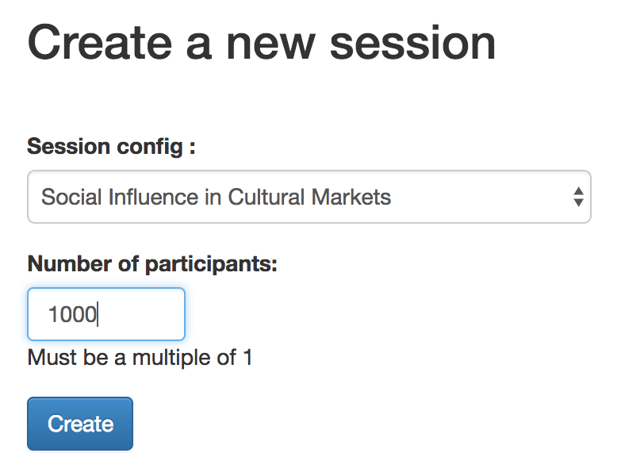
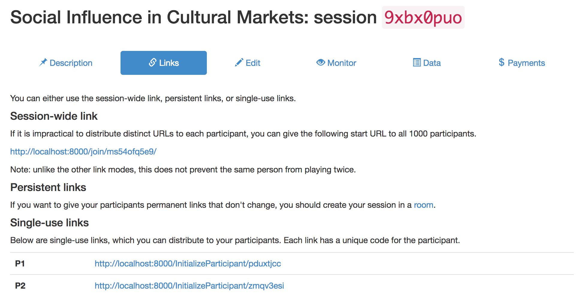

# Social Influence in Cultural Markets
## oTree Setup

Follow these instructions to set up and run the social influence online experiment.
These instructions will assume you are running oTree on a Linux-based system.

### 1. Install oTree
This experiment requires a web server with a working installation of oTree.
Instructions to install oTree on Linux, OS X, and Windows can be found
in the [https://otree.readthedocs.io/en/latest/install.html](oTree documentation).
Make sure to set a password for the admin settings.

### 2. Download the experiment
On your server, run the following command:

    git clone https://github.com/UM-CSS/CSSLabs-Experiments.git

### 3. Create an oTree project
Enter the following command and follow the prompts.
It isn't necessary to install the example projects.

    otree startproject oTree
    
### 4. Create a link to the experiment module

    cd oTree
    ln -s ../CSSLabs-Experiments/cultural_markets
    
### 5. Add a the experiment to the oTree settings
Open `settings.py` in your favorite browser (e.g., `nano`), and find following line:

    SESSION_CONFIGS = [

After this line, insert the following text:

    {
        'name': 'cultural_market',
        'display_name': "Social Influence in Cultural Markets",
        'num_demo_participants': 16,
        'app_sequence': ['cultural_market']
    },

### 6. Configure your experiment
Now edit the file `config.yaml` in the `cultural_market` directory to configure the parameters of your experiment.
In this file you can configure artifact names and labels, how artifacts are sorted, which statistics are visible to
participants, and whether artifacts have initial values for their statistics.
The file contains comments and examples for different configuration options.

### 7. Create the oTree database
Enter the following command and enter `y` when it prompts you to continue.

    otree resetdb

### 8. Start the oTree server
Assuming you have followed the server setup instructions in the oTree documentation,
enter the following command to start the server in production mode.
If you want to use a port other than the default, change `80` to the desired
port, e.g., `8000`.

    sudo -E env "PATH=$PATH" otree runprodserver 80

### 9. Create a session
Open the oTree admin webpage in a web browser.
Navigate to the `Sessions` tab and click the `Create new session` button.

Select "Social Influence in Cultural Markets" from the dropdown list.
Also enter the maximum number of participants.
Note that if there are a large number of participants, it may take several
minutes to create the session.
The orginal Salganik and Watts study used 8206 participants.
Finally, click `Create`.

### 10. Send links to your participants
Once the session is created, oTree will generate two types of links:
a single persistent link that can be sent to all players,
and a single-use link for each participant.

### 11. Downloading data
You can view the experiment data online by clicking the `Data` tab.

You can also download a CSV of the data using the link at the bottom of the page.

